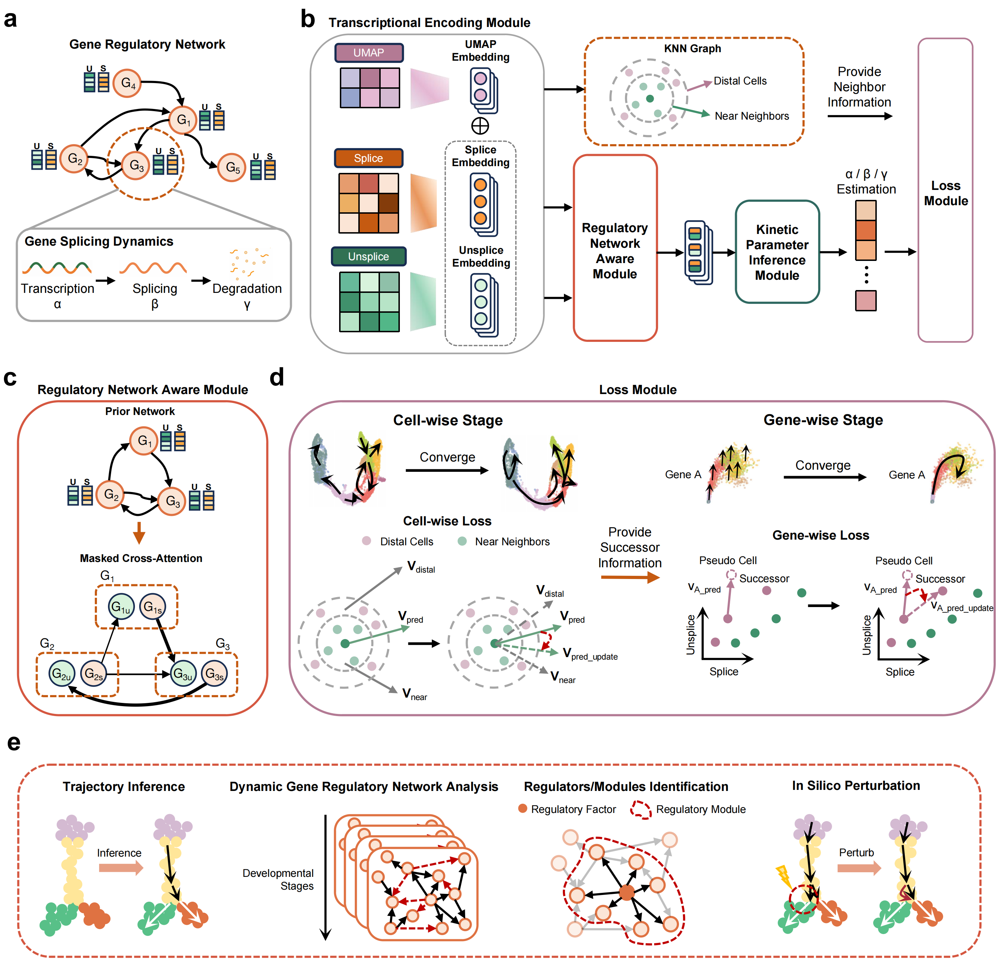

GRAVITY predicts RNA velocity and regulatory rewiring by dynamic regulatory mechanism-enhanced deep learning
==========================================================================================================

GRAVITY 是论文 “GRAVITY predicts RNA velocity and regulatory rewiring by
dynamic regulatory mechanism-enhanced deep learning” 对应的软件实现。它将
RNA velocity 推断与动态基因调控网络建模结合起来，整合未剪接/已剪接 RNA
丰度、细胞嵌入和先验基因调控网络，通过调控网络感知的 attention 结构联合建模
细胞状态转移、基因特异性转录动力学，以及动态调控网络重连。

本仓库提供面向研究使用的 Python 实现。流程先优化细胞层面的 velocity 与未来位置，再细化基因层面的动力学参数，并导出基于 attention 的调控网络摘要用于后续分析。

方法概览
--------


特性
----
- 基于已剪接/未剪接计数的动态调控网络感知 RNA velocity 推断；
- 两阶段优化：先进行细胞层面的轨迹恢复，再进行基因层面的动力学细化；
- 结合先验 GRN 的 attention 导出，用于调控因子和功能模块分析；
- 支持细胞层轨迹和指定基因的速度可视化。
- 输入和中间计数表参考 cellDancer 的长表数据存储形式，GRAVITY 会进一步转换成两阶段模型使用的内部宽表 `combine.csv`。

安装
----
建议使用 Python 3.10 或 3.11 并创建虚拟环境：

```bash
python3.10 -m venv .venv
source .venv/bin/activate
pip install -e .
```

如需 GPU，请先安装对应的 `torch` CUDA 版本，然后执行 `pip install -e .`。例如 CUDA 11.7 环境：

```bash
pip install --index-url https://download.pytorch.org/whl/cu117 "torch==2.0.1+cu117"
pip install -e .
```

快速开始（端到端）
-----------------
请先将胰腺内分泌发生数据长表放到
`data/PancreaticEndocrinogenesis_cell_type_u_s.csv`，或把 `raw_counts`
改成自己的兼容 CSV 路径。

```python
from gravity import PipelineConfig, run_pipeline

cfg = PipelineConfig(
    raw_counts="data/PancreaticEndocrinogenesis_cell_type_u_s.csv",
    workdir="gravity_outputs_pancreas",
    prior_network="prior_data/network_mouse.zip",
    gene_order_path="data/pancreas/reference_checkpoints/pancreas_genes.txt",
    accelerator="gpu",
    devices=1,
    batch_size=16,
    stage1_epochs=6,
    stage2_epochs=4,
    stage1_lr=1e-6,
    stage2_lr=1e-4,
    make_plot=True,
    plot_genes=["GCG", "INS2"],
)
outputs = run_pipeline(cfg)
print(outputs)
```

无监督和对比学习目标对学习率略敏感。参考运行建议从
`stage1_lr < 1e-5` 开始，`stage2_lr` 通常在 `1e-3` 到 `1e-5`
之间调参。

从 h5ad 转换为 CSV
-------------------
GRAVITY 使用和 cellDancer 类似的长表计数存储形式：每一行对应一个
cell-gene pair，并包含剪接/未剪接计数及细胞元信息。若数据源是 AnnData，可先使用
`export_intermediate_from_h5ad` 转成该长表 CSV：

```python
from gravity import export_intermediate_from_h5ad

export_intermediate_from_h5ad(
    input_h5ad="data/postprocessed.h5ad",
    output_csv="data/PancreaticEndocrinogenesis_cell_type_u_s.csv",
    n_top_genes=1000,
    embed_key="X_umap",
    celltype_key="celltype",
)
```
该工具会检查所需的 spliced/unspliced layers，并将嵌入坐标和聚类标签一并写入长表 CSV。

完成后，`workdir` 通常包含：`combine.csv`、`stage1.csv`/`stage1.ckpt`、`future_positions.npy`、`stage2.csv`/`stage2.ckpt`、`attentions/`、`velocity_plots/*.png`（若开启绘图）。

胰腺内分泌发生参考权重位于 `data/pancreas/reference_checkpoints/`：

```text
data/pancreas/reference_checkpoints/pancreas_stage1.ckpt
data/pancreas/reference_checkpoints/pancreas_stage2.ckpt
data/pancreas/reference_checkpoints/pancreas_genes.txt
```

这两个 checkpoint 可以直接作为胰腺 stage-1 和 stage-2 权重使用。对应的参考导出
命名为 `pancreas_stage1_reference.csv` 和 `pancreas_stage2_reference.csv`；
它们是较大的胰腺参考结果，不直接纳入 git。
复现已发布的胰腺 checkpoint 时，还需要传入
`gene_order_path="data/pancreas/reference_checkpoints/pancreas_genes.txt"`；
模型权重和 attention tensor 按 gene index 对齐，同一批基因但顺序不同并不等价。

模块化用法
----------
```python
from gravity import (
    preprocess_counts,
    resolve_gene_order,
    CellStageConfig, train_cell_stage,
    GeneStageConfig, train_gene_stage,
)
from gravity.tools.future import estimate_future_positions
from gravity.plotting.velocity import plot_velocity_cell, plot_velocity_gene

RAW_COUNTS = "data/PancreaticEndocrinogenesis_cell_type_u_s.csv"
WORKDIR = "gravity_outputs_pancreas"
PRIOR_NET = "prior_data/network_mouse.zip"
GENE_ORDER = "data/pancreas/reference_checkpoints/pancreas_genes.txt"
genes = resolve_gene_order(None, GENE_ORDER)

middle_csv = preprocess_counts(
    RAW_COUNTS,
    f"{WORKDIR}/combine.csv",
    gene_order=genes,
)

cell_cfg = CellStageConfig(
    raw_counts=RAW_COUNTS,
    middle_csv=str(middle_csv),
    prior_network=PRIOR_NET,
    output_dir=WORKDIR,
    gene_subset=genes,
    gene_order_path=GENE_ORDER,
    accelerator="gpu",
    devices=1,
    batch_size=16,
    learning_rate=1e-6,
)
stage1 = train_cell_stage(cell_cfg)

estimate_future_positions(stage1["stage1_csv"], f"{WORKDIR}/future_positions.npy")

gene_cfg = GeneStageConfig(
    raw_counts=RAW_COUNTS,
    middle_csv=str(middle_csv),
    stage1_checkpoint=str(stage1["checkpoint"]),
    future_positions=f"{WORKDIR}/future_positions.npy",
    prior_network=PRIOR_NET,
    output_dir=WORKDIR,
    gene_subset=genes,
    gene_order_path=GENE_ORDER,
    accelerator="gpu",
    devices=1,
    batch_size=16,
    epochs=4,
    learning_rate=1e-4,
)
stage2 = train_gene_stage(gene_cfg)

plot_velocity_cell(str(stage2["stage2_csv"]), output_path=f"{WORKDIR}/cell_velocity.png")
plot_velocity_gene(str(stage2["stage2_csv"]), gene="INS2", output_path=f"{WORKDIR}/ins2_velocity_expression.png")
```

关键配置
--------
- `PipelineConfig`: `gene_subset`、`gene_order_path`、`stage*_epochs`、`stage*_lr`、`val_fraction_stage*`（默认为 0，无验证集）、`future_tau`、`accelerator/devices/strategy`、`make_plot/plot_genes`；
- `CellStageConfig`: `attention_output`、`attention_topk`；
- `GeneStageConfig`: `future_positions`、`stage1_checkpoint`。

输入格式
--------
GRAVITY 参考 cellDancer 的长表计数存储形式。CSV 至少包含：`cellID`、
`gene_name`、`unsplice`、`splice`、`embedding1`、`embedding2`；可选
`clusters` 用于上色。先验压缩包 `prior_data/network_mouse.zip` 与原始格式保持一致。
大型原始计数表不直接存放在仓库中；pancreatic endocrinogenesis smoke test 默认使用的路径见 `data/README.md`。

常见问题
--------
- 显存不足：降低 `batch_size` 或缩小 `gene_subset`；
- 无 GPU：Lightning 自动回退至 CPU；
- 缺少可选依赖：绘图/采样可能自动禁用；
- 日志：使用 `gravity.utils.log_verbose` 等工具。

开发透明说明
------------
本仓库在工程重构、文档整理和实现层面的检查中使用 Codex 作为辅助工具。
GRAVITY 的模型设计、生物学分析思路和计算方法均由作者完成；工具辅助产生
的改动均经过作者人工审阅和测试后发布。

引用
----
如在研究中使用本包，请引用 GRAVITY 论文：“GRAVITY predicts RNA velocity and regulatory rewiring by dynamic regulatory mechanism-enhanced deep learning”。方法部分建议同时报告软件版本、运行环境和关键配置参数。

贡献与许可
----------
欢迎提交 Issue/PR（请附复现步骤与命令序列）。本软件包遵循 MIT 许可。
